summary: 如何使用 Gerrit + Zadig 实现产品级持续交付
id: Gerrit
categories: Gerrit
environments: Web
status: Published
feedback link: https://github.com/koderover/zadig-bootcamp/issues


# 如何使用 Gerrit + Zadig 实现产品级持续交付

## 概述

Duration: 0:01:00

本文介绍 Gerrit 仓库管理的项目如何在 Zadig 上快速搭建，下面以 Voting 项目为例，该项目包含 Python, Redis, Postgres, Node.js, and .Net 等相对典型的微服务应用程序组合。以下步骤包含从 Code 到 Ship 的整个过程的演示。

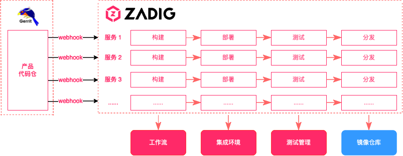

## 准备工作

本案例所用代码及配置 fork 自 [项目案例源码](https://github.com/koderover/zadig/tree/main/examples/voting-app)，请将源码放在自己的 Gerrit 代码库。源码主要包含：
- 案例中 5 个服务的 Kubernetes YAML 配置：[`YAML`](https://github.com/koderover/zadig/tree/main/examples/voting-app/freestyle-k8s-specifications)
- 案例中 3 个业务服务的 Dockerfile 文件：[`result`](https://github.com/koderover/zadig/tree/main/examples/voting-app/result/Dockerfile)、[`vote`](https://github.com/koderover/zadig/tree/main/examples/voting-app/vote/Dockerfile)、[`worker`](https://github.com/koderover/zadig/tree/main/examples/voting-app/worker/Dockerfile)

案例中使用的 Ingress 对 K8s 集群版本有要求（1.19 及以上），请确保 K8s 集群版本符合并根据自己的域名及解析情况按需修改 result 服务和 vote 服务的规则：
- result 服务 Ingress 配置：[result](https://github.com/koderover/zadig/blob/main/examples/voting-app/freestyle-k8s-specifications/result/result-service.yaml#L17)
- vote 服务 Ingress 配置：[vote](https://github.com/koderover/zadig/blob/main/examples/voting-app/freestyle-k8s-specifications/vote/vote-service.yaml#L17)

Positive
: 如果你的 K8s 集群版本在 [1.9, 1.19) 区间内，也可以使用 [此处](https://github.com/koderover/zadig/tree/release-1.13.0/examples/voting-app) 的源码来实践本教程。

## 接入 Gerrit 代码源

### 步骤 1：获取 Gerrit 的用户名和密码

Gerrit 管理员可以通过点击 Gerrit 右上角的 `Settings` 按钮，进入设置页面。找到 HTTP 密码 `HTTP Credentials` 配置区域，点击 生成新密码 `GENERATE NEW PASSWORD`，并复制新生成的密码。


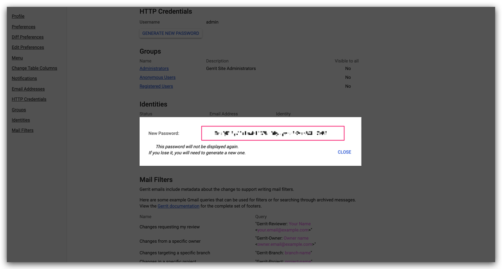

### 步骤 2：将配置填入 Zadig

切换到 Zadig 系统，管理员依次点击 系统设置 -> 集成管理 -> 代码源集成 -> 点击添加按钮。

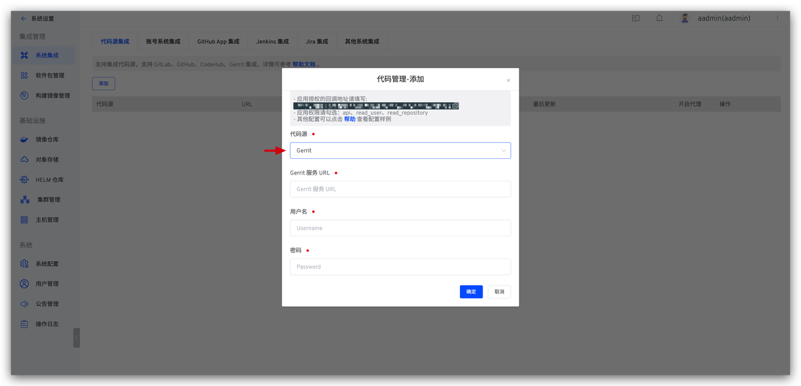

依次填入如下已知信息：
- `代码源`：此处选择 Gerrit
- `Gerrit` 服务 URL： Gerrit 地址，比如 https://gerrit.example.com
- `用户名`：Gerrit 用户名
- `密码`： 上一个步骤中复制的密码

信息确认无误后点击`确定`，至此 Gerrit 集成完毕。

## 配置项目

Duration: 0:01:00

进入 Zadig 系统，点击`新建项目` -> 填写项目名称 `voting` -> 选择 `K8s YAML 项目` -> 点击立即新建。


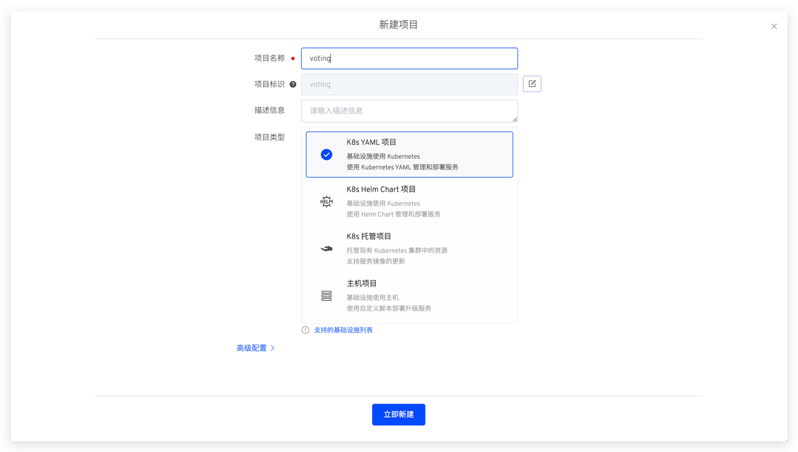

## 新建服务并配置构建

Duration: 0:08:00

点击`从代码库同步`按钮 -> 选择仓库信息 -> 选择文件目录 `freestyle-k8s-specifications` -> 点击`同步`按钮即可。

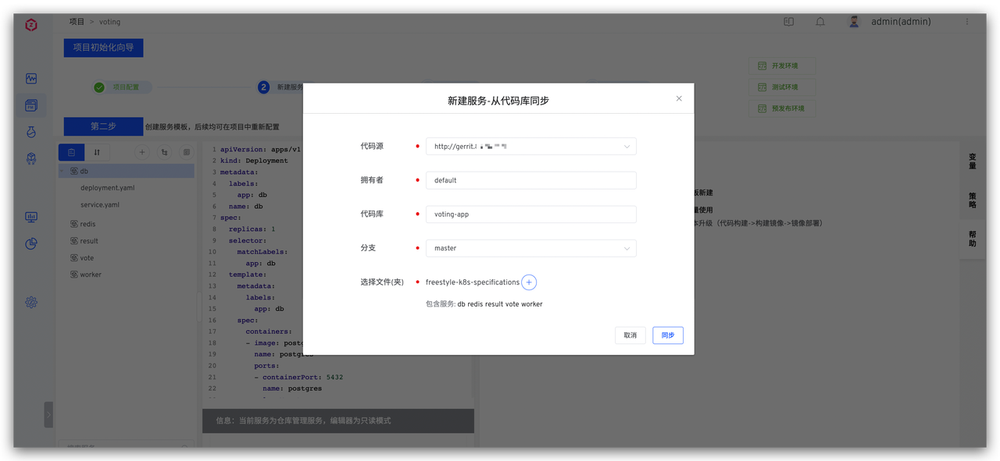

接下来为服务配置构建，具体操作步骤：选择具体的服务 -> 点击`添加构建` -> 填写代码信息和构建脚本。

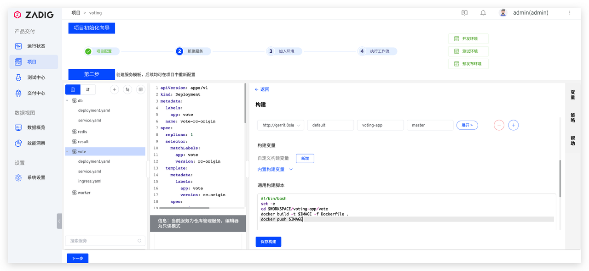

以 `vote` 服务为例，在构建脚本中填写以下代码：

```bash
#!/bin/bash
set -e
cd $WORKSPACE/voting-app/<service-directory>
docker build -t $IMAGE -f Dockerfile .
docker push $IMAGE
```

重复以上配置服务构建过程，完成 `vote`、`worker` 和 `result` 的构建配置，注意根据不同的服务修改脚本中的 `&lt;service-directory&gt;` 参数。

## 加入环境

Duration: 0:02:00

- 点击向导的「下一步」。这时，Zadig 会根据你的配置，创建两套包括上述 5 个服务的环境以及相关工作流，如下图所示。

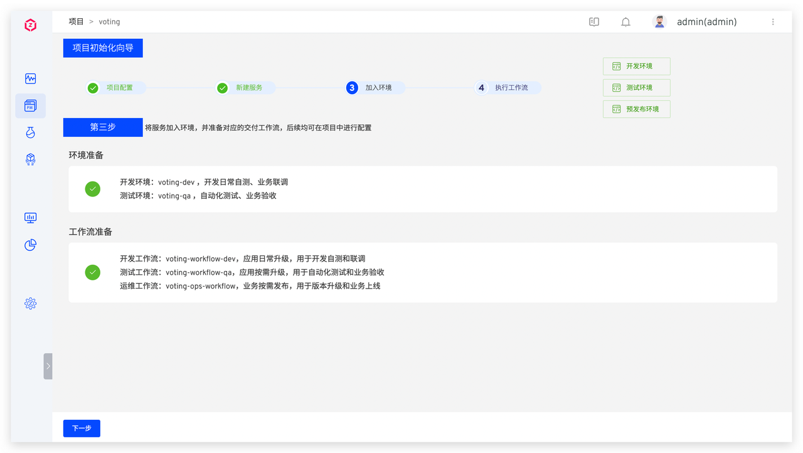

- 继续点击下一步完成向导流程。

## 工作流交付

Duration: 0:07:00

使用工作流对环境中的服务进行部署更新，以 `dev` 环境为例操作步骤如下。

- 点击 `voting-workflow-dev` 工作流 -> 选择需要更新的服务（比如 `vote` 和 `result`），点击「启动任务」运行工作流。

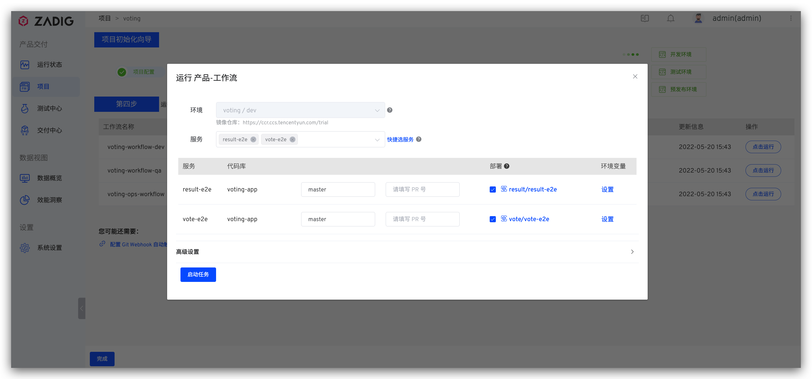

- 触发工作流后，可查看工作流运行状况，点击服务左侧的展开图标可查看服务构建的实时日志。

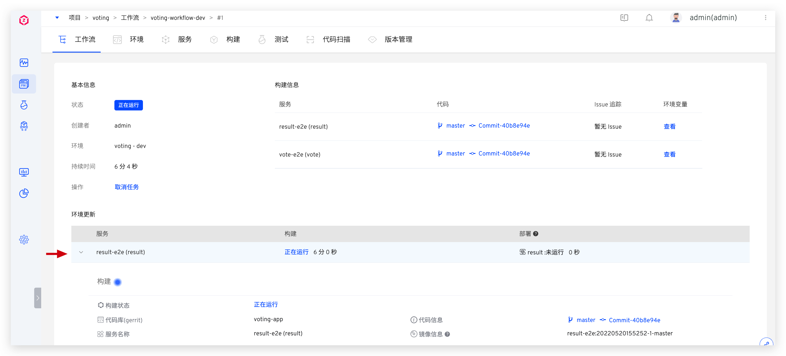

- 待工作流运行完毕，进入 `dev` 环境，可看到 `vote` 服务和 `result` 服务被部署更新成功，镜像信息均被更新。


- 点击 `result` 和 `vote` 暴露出来的 URL 可以查看网站。

需要注意此处的 URL 正常访问依赖于服务的 Ingress 配置，需要在准备工作中根据自己的域名及解析情况按需修改。

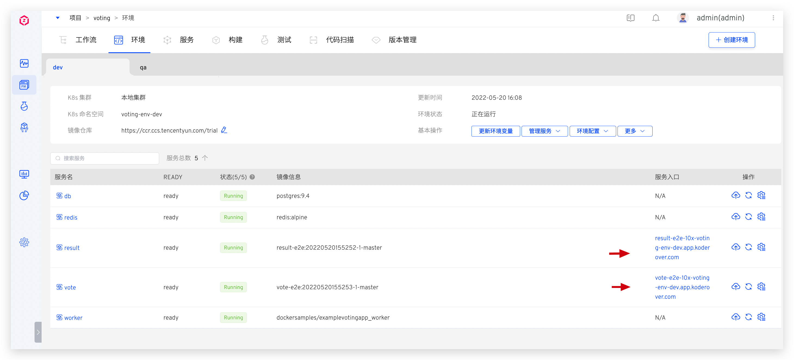

`vote` 页面：

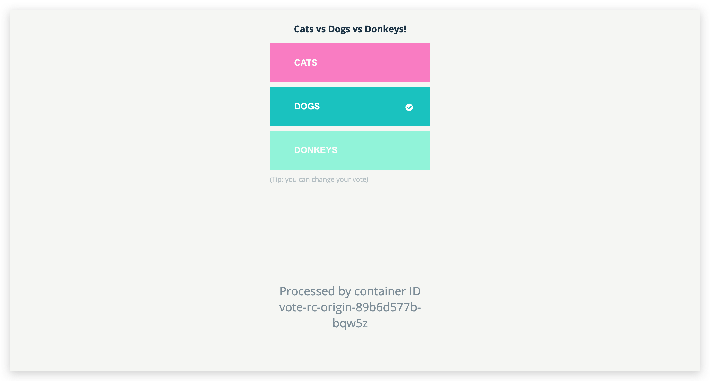

`result` 页面：

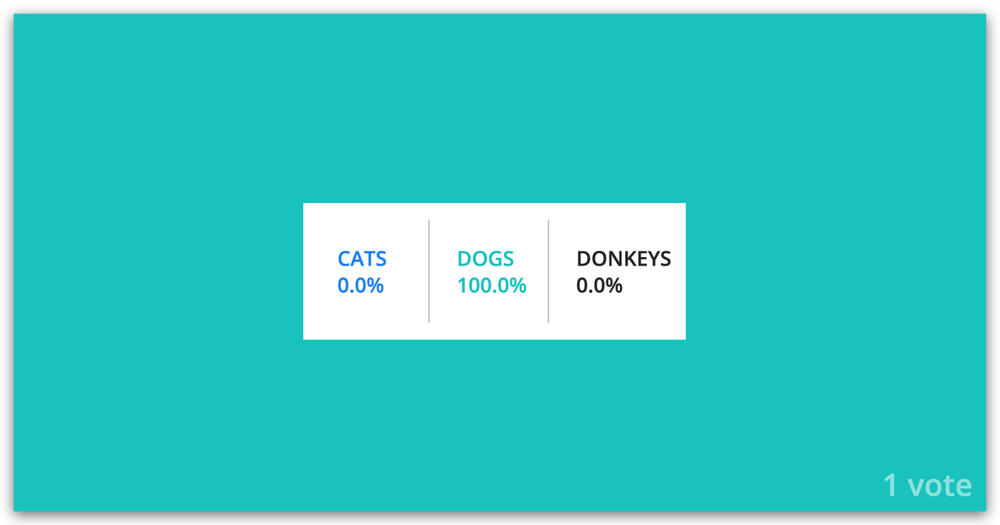

## 配置自动触发工作流

Duration: 0:04:00

添加触发器，使得代码 Change merged、Patchset created 都能自动触发 `result`、`vote` 服务的重新构建和部署。

- 配置工作流

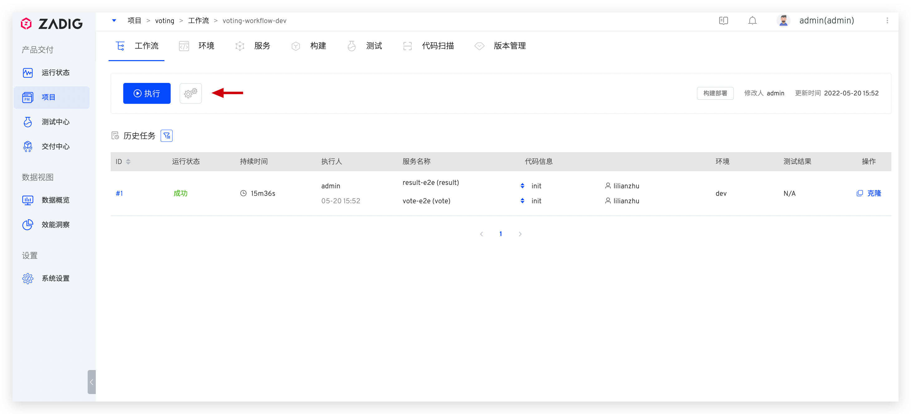

- 添加 Webhook 触发器 -> 打开 Webhook 开关 -> 添加配置 -> 填写配置

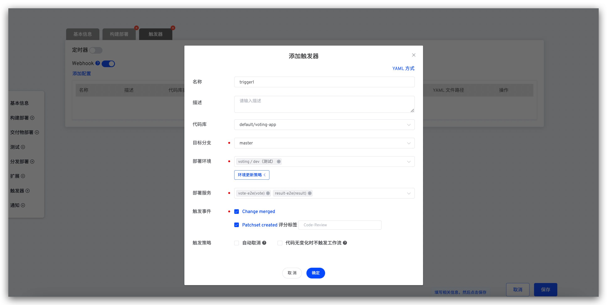

- 保存对工作流的修改

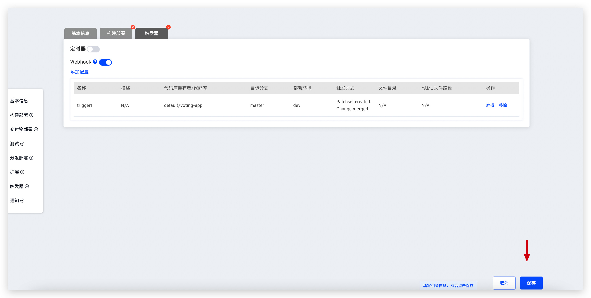

## 代码变更，触发工作流

Duration: 0:09:00

- 本地修改代码，交换 `vote` 服务中 `CATS` 和 `DOGS` 的背景颜色，代码提交到 Gerrit。


- 在 Gerrit 上创建 Change，会有触发工作流的信息。

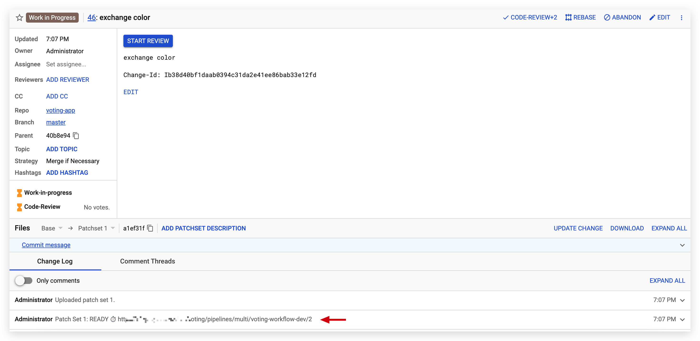

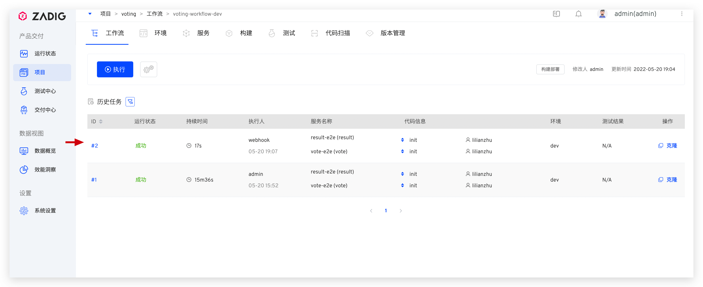

- 待工作流执行完毕，进入`项目`-> `voting` -> 环境，点击 `dev` 环境中 `vote` 服务的服务入口，查看网站结果，可以看见 `CATS` 和 `DOGS` 背景栏颜色已被更改。

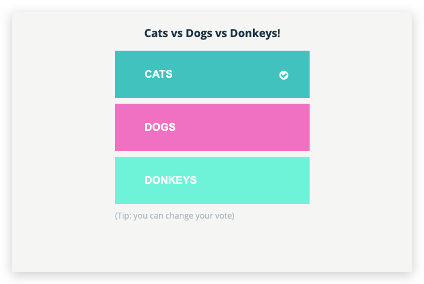

## 配置 IM 通知

Duration: 0:04:00

- 配置工作流


- 添加通知 -> 参考 [IM 通知](https://docs.koderover.com/zadig/project/workflow/#im-状态通知)填写相关配置 -> 保存修改

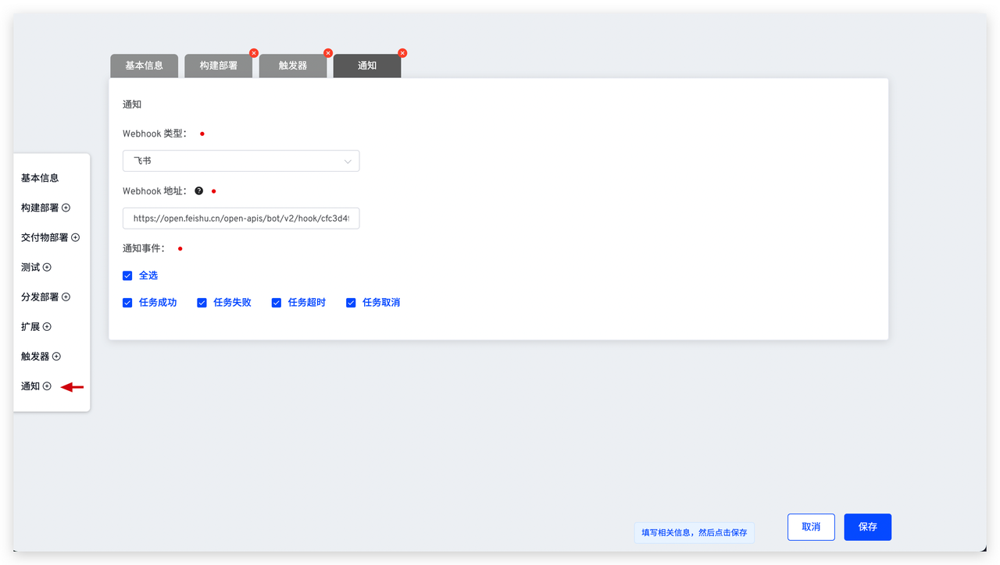

- 工作流执行后，会自动将运行结果和环境、服务等信息推送到 IM 系统中，方便及时跟进

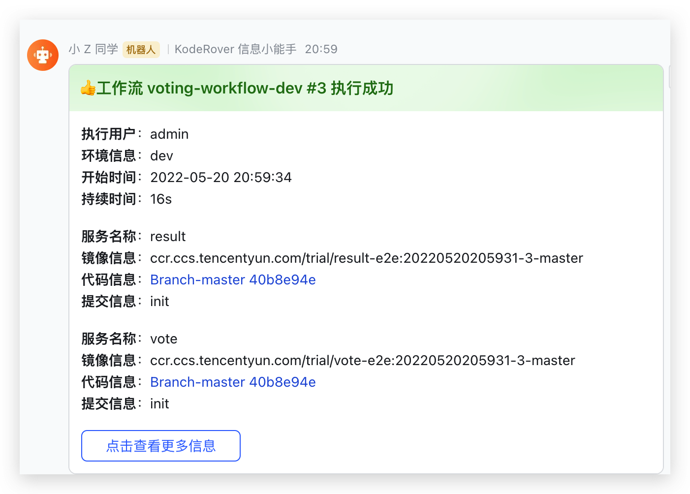
