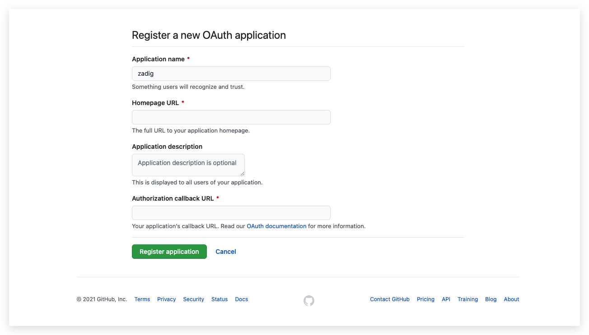
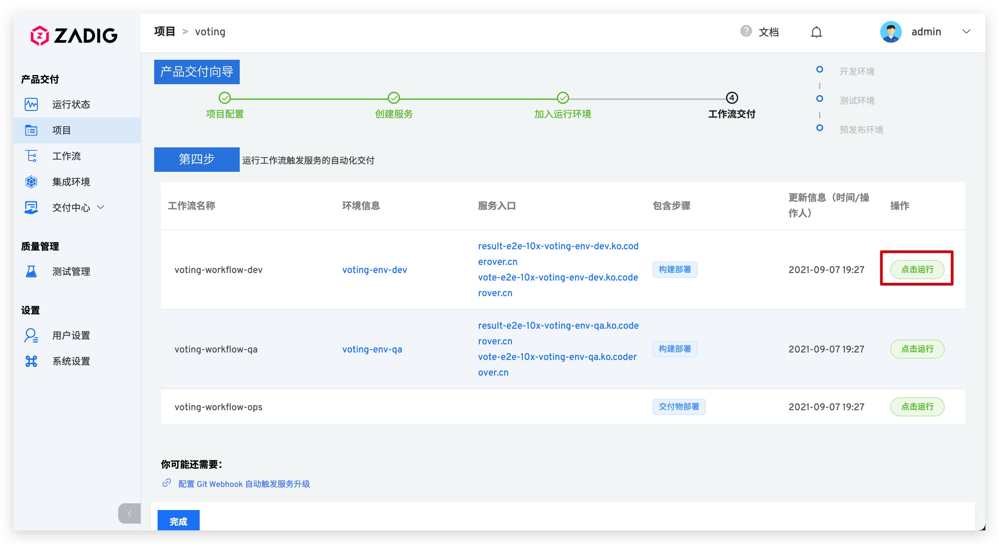
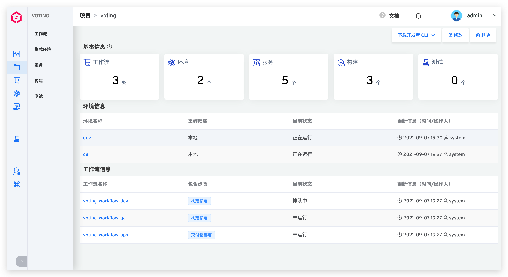
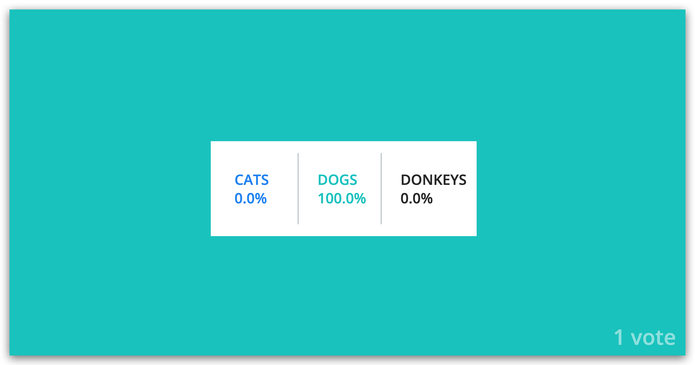
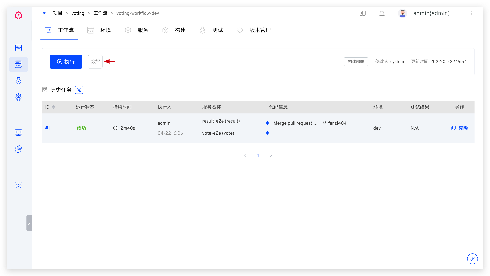

summary: 如何使用 GitHub + Zadig 实现产品级持续交付
id: GitHub
categories: GitHub
environments: Web
status: Published
feedback link: https://github.com/koderover/zadig-bootcamp/issues

# 如何使用 GitHub + Zadig 实现产品级持续交付

## 概述

Duration: 0:01:00

本文介绍 GitHub 仓库管理的项目如何在 Zadig 上快速搭建，下面以 Voting 项目为例，该项目包含 Python, Redis, Postgres, Node.js, and .Net 等相对典型的微服务应用程序组合。以下步骤包含从 Code 到 Ship 的整个过程的演示。

## 准备工作

Duration: 0:02:00

我们提供了[项目案例源码](https://github.com/koderover/Zadig/tree/master/examples/voting-app) 供您直接使用，该代码仓库主要包含：
- 服务 Yaml 文件： [`https://github.com/koderover/Zadig/tree/master/examples/voting-app/freestyle-k8s-specifications`](https://github.com/koderover/Zadig/tree/master/examples/voting-app/freestyle-k8s-specifications)
- 服务 Dockerfile 文件：业务服务目录内有一个对应的 Dockerfile 文件。

## 接入 GitHub 代码源

Duration: 0:05:00

### 新建 GitHub OAuth 应用程序

1. 个人账号下的代码库接入：
可以通过点击用户名 -> `Settings` -> `Developer settings` -> `OAuth Apps` 来新建应用程序。

2. GitHub Organization 下的代码仓库接入：
可以通过点击 `Organization Settings` -> `Developer settings` -> `OAuth Apps` 来新建应用程序。

下面以 GitHub Organization 为例，如下所示。

- 打开 `Organization Settings`。


- 选择 `Developer settings` -> `OAuth Apps`，点击 `New OAuth App` 新建应用程序。


### 配置 GitHub OAuth 应用程序



在新建应用程序页面，你需要进行如下步骤：

- Application name：zadig，也可以填写可识别的任一名称。
- Homepage URL：http://[koderover.yours.com]
- Authorization CallBack URL： `http://[koderover.yours.com]/api/directory/codehosts/callback`
- 点击创建

### 获取 Client ID、Client Secret 信息

应用创建成功后，GitHub 会返回应用的基本信息，点击 `Generate a new client secret` 生成 `Client Secret`。


此时页面包括完整的 `Client ID` 、`Client Secret`。


### 将 Client ID、Client Secret 集成到系统

切换到 Zadig 系统，管理员依次点击`系统设置` -> `集成管理` -> `代码源集成` -> 点击添加按钮。


依次填入如下已知信息：

- `代码源`：此处选择 GitHub
- `Client ID`：应用的 Client ID
- `Client Secret`：应用生成的 Client Secret
- `Organization`：GitHub 要授权的 Organization 名称或者个人 GitHubID

信息确认无误后点击 `前往授权`，耐心等待，此时会系统会跳转到 GitHub 进行授权。


点击授权按钮，同意授权后，GitHub 会跳转到 Zadig 系统，至此 GitHub 集成完毕。


## 项目配置

Duration: 0:01:00

进入 zadig 系统。


新建项目，项目名为`voting`。


## 创建服务与服务构建

Duration: 0:03:00

这里我们需要为以下 5 个服务添加服务配置：

* vote
* worker
* result
* redis
* db

其中以下三个服务我们有代码，还需要添加构建：

* vote
* worker
* result

而 redis 和 db 直接使用标准镜像，所以不需要添加构建。

Negative 
: 服务配置指的是 Yaml 对这个服务的定义。Kubernetes 可以根据这个定义产生出服务实例。可以理解为 Service as Code。


Zadig 提供两种方式管理这些模板：

* 系统平台管理：在 Zadig 中直接输入 Yaml 。
* 代码仓导入与同步：从某个 Git 仓中导入，之后提交到代码仓的 Yaml 变更会自动同步到 Zadig 系统上。

Positive
: 配置 [Webhook](https://docs.koderover.com/zadig/settings/webhook-config/#github-webhook-%E9%85%8D%E7%BD%AE) 后，Zadig 系统即可自动同步指定代码仓库中的服务 Yaml 配置。


这里，我们使用代码仓导入的方式。上面我们已经在代码仓的 [freestyle-k8s-specifications](https://github.com/koderover/zadig/tree/master/examples/voting-app/freestyle-k8s-specifications) 文件目录中准备好了这些 Yaml。现在要做的就是把它们导入。

 - 加载服务配置：点击`仓库托管`按钮 -> 选择仓库信息 -> 选择文件目录。Zadig 支持一次性导入多个服务，同步 `examples`->`voting-app`->`freestyle-k8s-specifications` 文件目录可导入此次案例中所需的 5 个服务。
 - 配置服务构建：选择服务 -> 点击`添加构建` -> 填写构建脚本。


构建脚本，填写以下代码，这个服务的构建步骤是使用 Docker 构建镜像，注意根据不同的服务修改脚本中的 `&lt;service-directory&gt;`参数。

```bash
cd $WORKSPACE/zadig/examples/voting-app/<service-directory>
docker build -t $IMAGE -f Dockerfile .
docker push $IMAGE
```

重复以上配置服务构建过程，完成 vote、worker 和 result 的配置。

## 加入运行环境

Duration: 0:01:00

- 点击向导的「下一步」。这时，Zadig 会根据你的配置，创建两套环境（dev，qa），以及相关工作流。


- 点击下一步完成向导。至此，onboarding 完成。一个有 5 个微服务的系统，2 套环境、3 条工作流已经产生。


## 工作流交付

Duration: 0:01:00

- 点击「运行」，可以运行工作流。



- 选择需要更新的服务，比如 vote 和 result，点击「启动」运行工作流。


- 查看工作流运行状况：


- 下面是项目的总体状态：



- 进入集成环境，查看服务列表并点击 result 和 vote 暴露出来的 URL 可以查看网站。




## 配置自动触发工作流

Duration: 0:02:00

Positive
: 前提条件：配置 GitHub 的 Webhook，Webhook 配置请参考 [GitHub Webhook](https://docs.koderover.com/zadig/settings/webhook-config/#github-webhook-%E9%85%8D%E7%BD%AE)

添加触发器，使得代码 push 或者 Pull Request 都触发 result，vote，worker 三个服务的重新构建和部署：

- 进入工作流配置页面



- 添加 Webhook 触发器


- 配置 Webhook 触发器


- 保存工作流


## 改动代码，触发工作流

Duration: 0:02:00

我们下面对 vote 服务中 Dog 一栏的颜色做改动。

- 改动代码：


- 查看工作流运行情况


- 查看网站运行结果：


