summary: 如何使用 Gitee + Zadig 实现产品级持续交付
id: Gitee
categories: Gitee
environments: Web
status: Published
feedback link: https://github.com/koderover/zadig-bootcamp/issues

# 如何使用 Gitee + Zadig 实现产品级持续交付

## 概述

Duration: 0:01:00

本文介绍 Gitee 仓库管理的项目如何在 Zadig 上快速搭建，下面以 microservice-demo 项目为例，该项目包含 Vue.js 前端服务和 Golang 后端服务，以下步骤包含从 Code 到 Ship 的整个过程的演示。

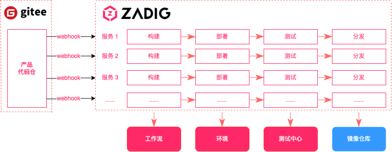

## 准备工作

Duration: 0:02:00

### 准备案例源码

本案例所用代码及配置 fork 自[项目案例源码](https://gitee.com/koderover/zadig/tree/main/examples/microservice-demo)，主要包含：

  - 服务 YAML 文件： [`https://gitee.com/koderover/zadig/tree/main/examples/microservice-demo/k8s-yaml`](https://gitee.com/koderover/zadig/tree/main/examples/microservice-demo/k8s-yaml)
  - 服务源码及 Dockerfile 文件：
    - Frontend：[`https://gitee.com/koderover/zadig/blob/main/examples/microservice-demo/frontend/`](https://gitee.com/koderover/zadig/blob/main/examples/microservice-demo/frontend/)
    - Backend：[`https://gitee.com/koderover/zadig/blob/main/examples/microservice-demo/backend/`](https://gitee.com/koderover/zadig/blob/main/examples/microservice-demo/backend/)

Positive
: 案例中使用的 Ingress 对 K8s 集群版本有要求（1.19 及以上），如果你的 K8s 集群版本在 [1.9, 1.19) 区间内，可以使用 [此处](https://gitee.com/koderover/zadig/tree/release-1.13.0/examples/microservice-demo) 的源码来实践本教程。

## 接入 Gitee 代码源

### 新建 Gitee 第三方应用

点击 Gitee 账号头像 -> 设置 -> 数据管理 -> 第三方应用 -> 创建应用来新建应用程序。


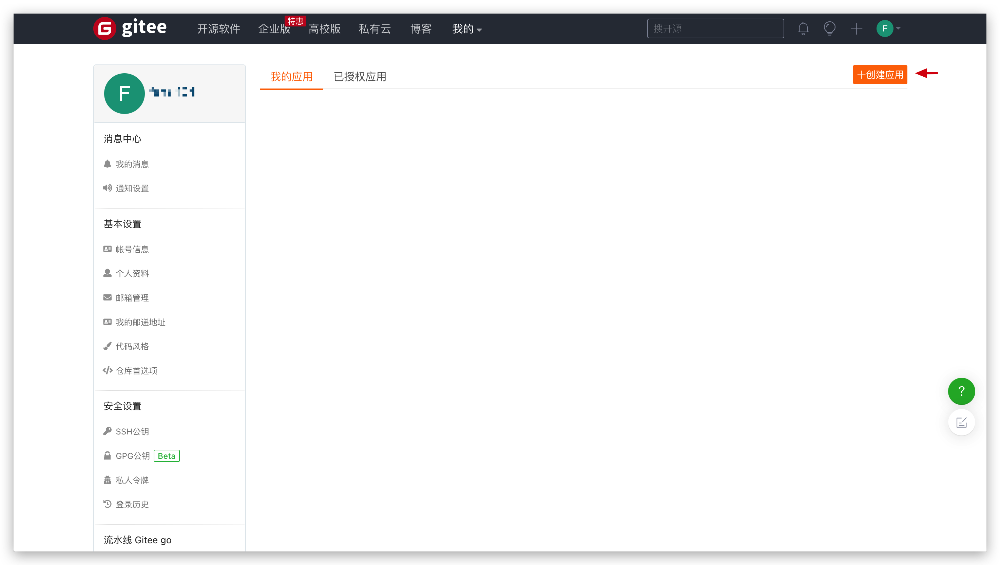

### 配置 Gitee 第三方应用


填写以下内容后点击创建：

- `应用名称`：zadig，也可以填写可识别的任一名称。
- `应用主页`：http://[koderover.yours.com]
- `应用回调地址`： `http://[koderover.yours.com]/api/directory/codehosts/callback`
- `上传 LOGO`： 上传符合格式和大小的图片
- `权限`： 勾选 `projects`、`pull_requests`、`hook`、`groups`

Positive
: 应用回调地址中 `koderover.yours.com` 需要替换为 Zadig 系统部署的实际地址

### 获取 Client ID、Client Secret 信息

应用创建成功后，可获取该应用对应的 `Client ID` 和 `Client Secret` 信息。

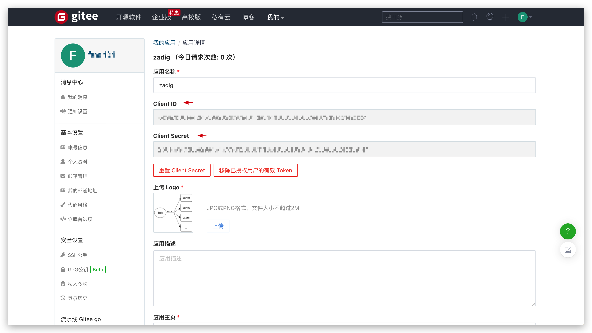

### 将配置填入 Zadig 系统

切换到 Zadig 系统，管理员依次点击`系统设置` -> `集成管理` -> `代码源集成` -> 点击添加按钮。

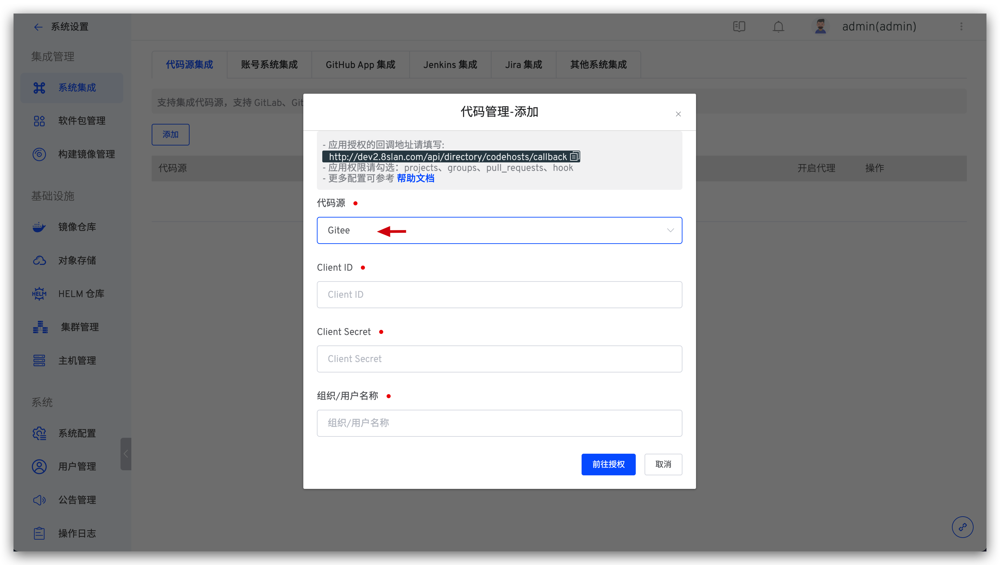

依次填入如下已知信息：

- `代码源`：此处选择 Gitee
- `Client ID`：上一步中获取的 Client ID
- `Client Secret`：上一步中获取的 Client Secret
- `组织/用户名称`：推荐填写 Gitee 账号的用户名，方便在 Zadig 系统中标识 Gitee 代码源的出处

信息确认无误后点击 `前往授权`，耐心等待，此时系统会跳转到 Gitee 进行授权。

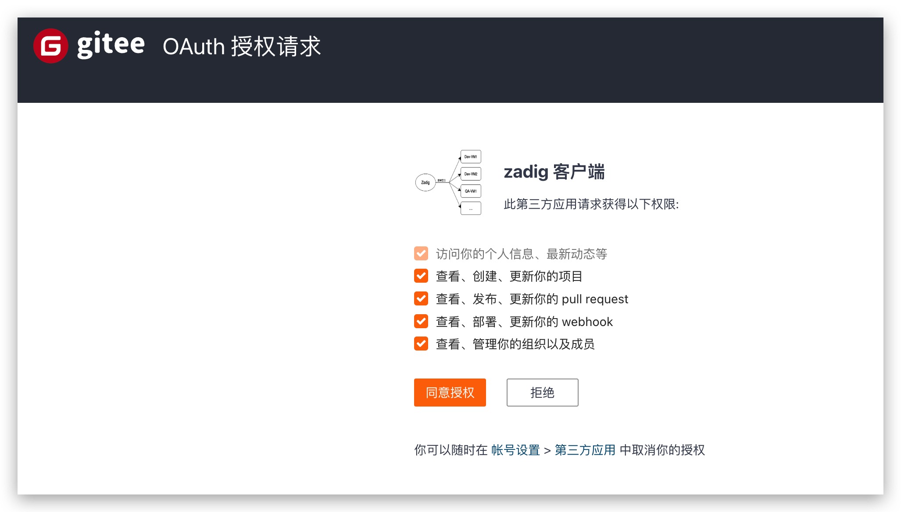

点击 `同意授权` 后，跳转到 Zadig 系统，至此 Gitee 集成完毕。

## 项目配置

Duration: 0:01:00

进入 Zadig 系统，点击`新建项目` -> 填写项目名称 `microservice-demo` -> 选择 `K8s YAML 项目` -> 点击`立即创建` -> 点击`下一步`。

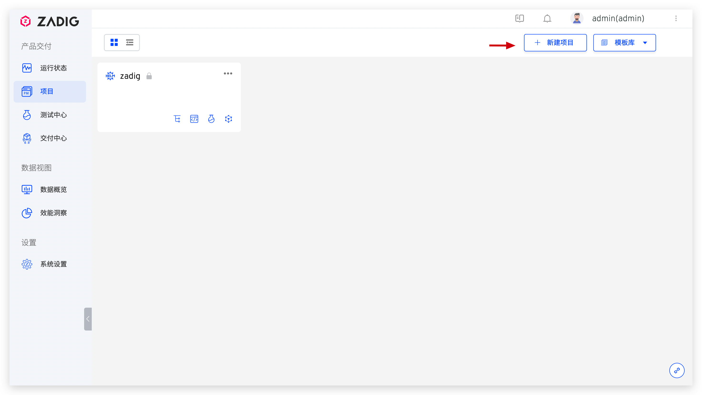


## 新建服务并配置构建

Duration: 0:05:00

### 新建服务

Negative
: 服务配置指的是 YAML 对这个服务的定义，Kubernetes 可以根据这个定义产生出服务实例。可以理解为 Service as Code。

Zadig 提供三种方式管理服务配置：

* 手工输入：在创建服务时手动输入服务的 K8s YAML 配置文件，内容存储在 Zadig 系统中。
* 从代码库同步：服务的 K8s YAML 配置文件在代码库中，从代码库中同步服务配置。之后提交到该代码库的 YAML 变更会被自动同步到 Zadig 系统上。
* 使用模板新建：在 Zadig 平台中创建服务 K8s YAML 模板，创建服务时，在模板的基础上对服务进行重新定义。

这里，我们使用从代码库同步的方式：点击`从代码库同步`按钮 -> 选择仓库信息 -> 选择文件目录 `examples`->`microservice-demo`->`k8s-yaml` -> 点击`同步`按钮即可。

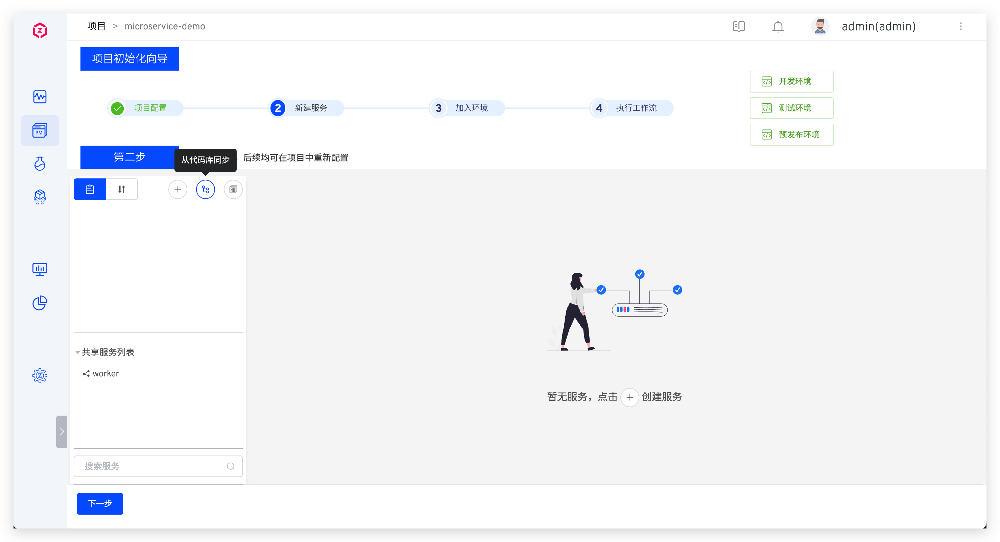
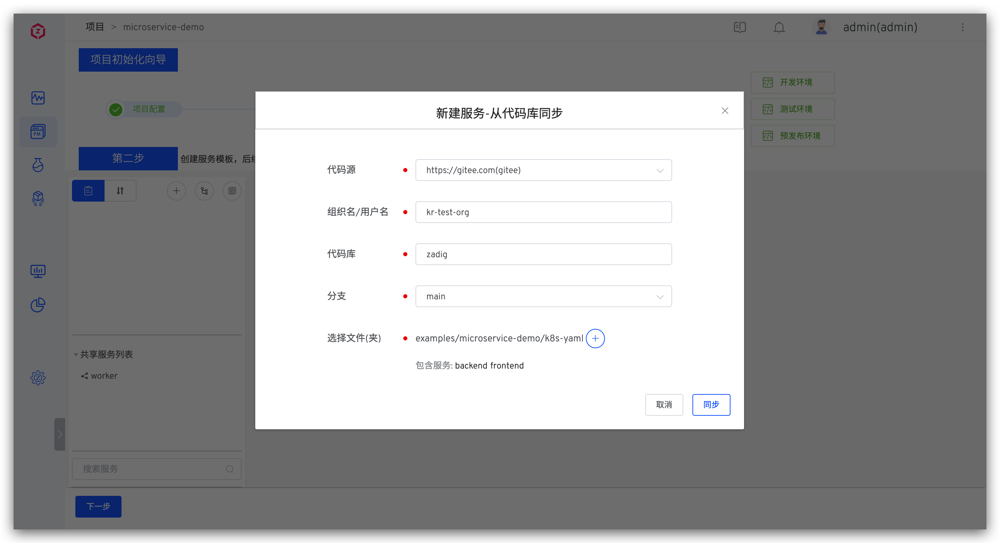

### 配置构建

配置后端服务构建：选择 `backend` 服务 -> 点击`添加构建` -> 填写构建配置和构建脚本后保存。


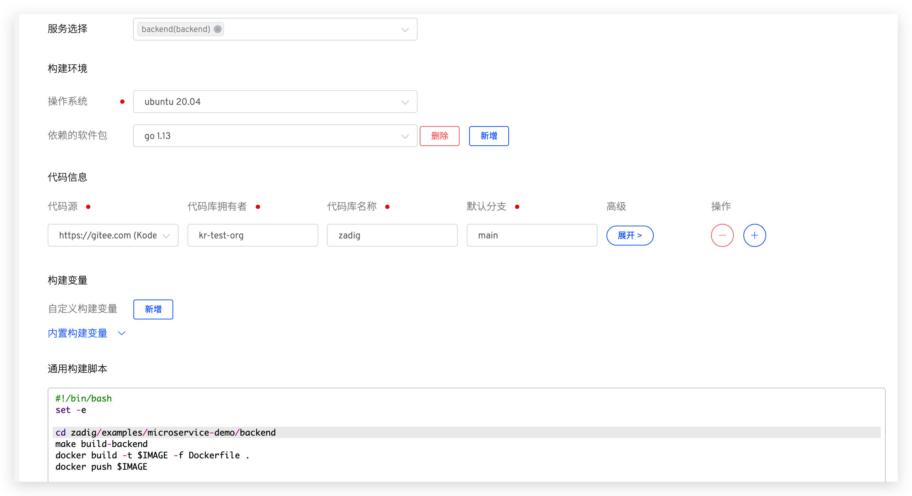

构建配置说明：
1. 应用列表：选择 `go 1.13`
2. 代码信息：准备工作中 fork 的代码仓库
3. 构建脚本如下：

```bash
cd zadig/examples/microservice-demo/backend
make build-backend
docker build -t $IMAGE -f Dockerfile .
docker push $IMAGE
```

同样的步骤为 `frontend` 服务配置构建并保存。


构建配置说明：
1. 代码信息：准备工作中 fork 的代码仓库
2. 构建脚本如下：

```bash
cd zadig/examples/microservice-demo/frontend
docker build -t $IMAGE -f Dockerfile .
docker push $IMAGE
```

## 加入环境

Duration: 0:01:00

- 点击向导的「下一步」。这时，Zadig 会根据你的配置，创建两套包括上述 2 个服务的环境以及相关工作流，如下图所示。

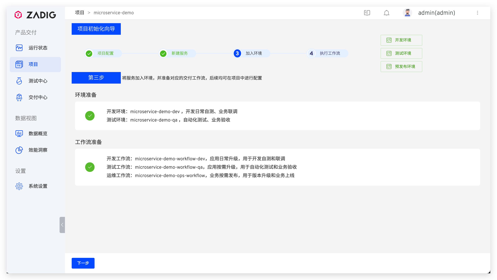

- 继续点击下一步完成向导流程。

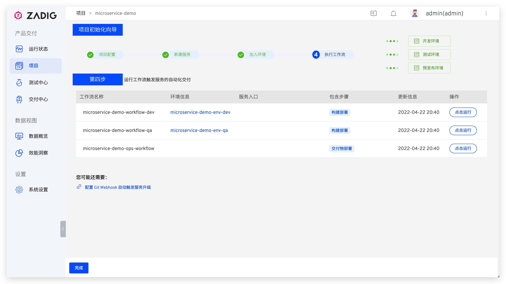

- 点击完成向导，项目概览如下，包括 2 套环境、3 条工作流。


- 点击进入到具体的环境中，可查看在环境中运行的服务信息。


## 工作流交付

Duration: 0:01:00

使用工作流对环境中的服务进行部署更新，以 `dev` 环境为例操作步骤如下。

- 点击 `microservice-demo-workflow-dev` 工作流 -> 选择服务，点击「启动任务」运行工作流。


- 触发工作流后，可查看工作流运行状况，点击服务左侧的展开图标可查看服务构建的实时日志。


- 待工作流运行完毕，进入 `dev` 环境，可看到 `backend` 服务和 `frontend` 服务被部署更新成功，镜像信息均被更新。

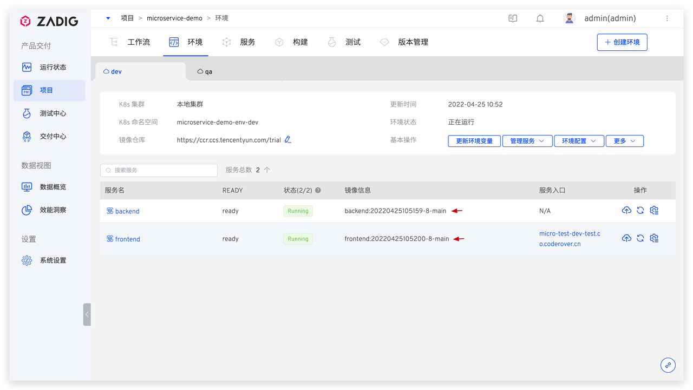

## 配置自动触发工作流

Duration: 0:02:00

添加触发器，使得代码 Push commit、Pull Request、Push tag 都能自动触发服务的重新构建和部署。

- 配置工作流


- 添加 Webhook 触发器 -> 打开 Webhook 开关 -> 添加配置 -> 填写配置 -> 保存配置 -> 保存对工作流的修改

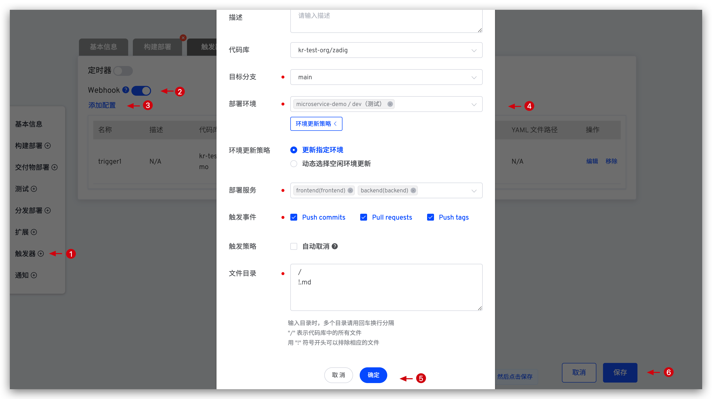

## 改动代码，触发工作流

Duration: 0:02:00

<!-- 暂不支持将工作流反馈到 Gitee PR 信息中，待支持后，该部分内容可修改 -->

- 以 Pull Request 为例，提交 Gitee PR 修改源代码

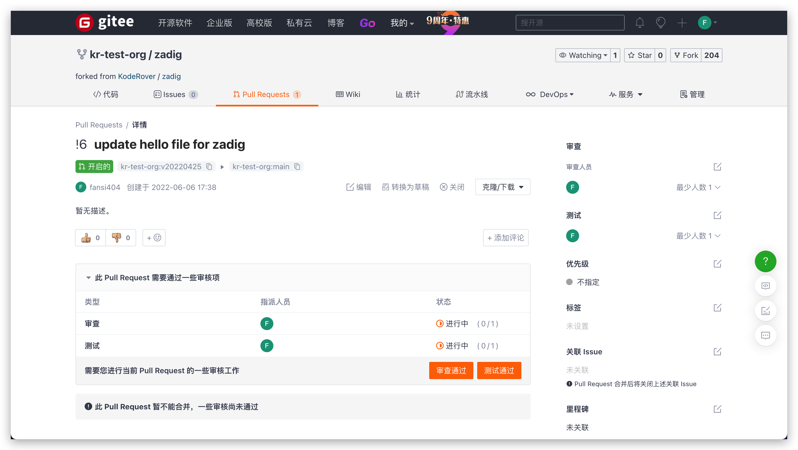

- 在 Gitee 的 PR 页面中，会有触发工作流的信息。可点击工作流链接快速跳转到 Zadig 中。


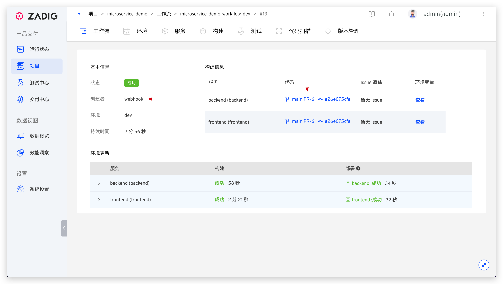

- 待工作流执行完毕，进入 `项目`->`microservice-demo`->`环境`，可看到服务的镜像已被自动触发的工作流更新。

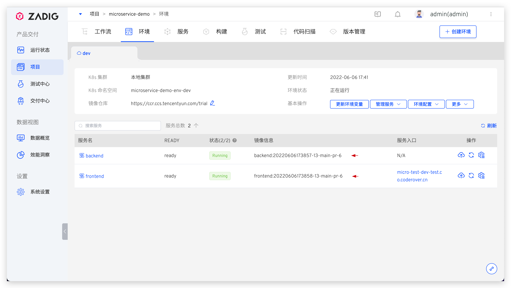

## 配置 IM 通知

Duration: 0:01:00

- 配置工作流


- 添加通知 -> 参考 [IM 通知](https://docs.koderover.com/zadig/v1.11.0/project/workflow/#im-%E7%8A%B6%E6%80%81%E9%80%9A%E7%9F%A5)填写相关配置 -> 保存修改


- 工作流执行后，会自动将运行结果和环境、服务等信息推送到 IM 系统中，方便及时跟进

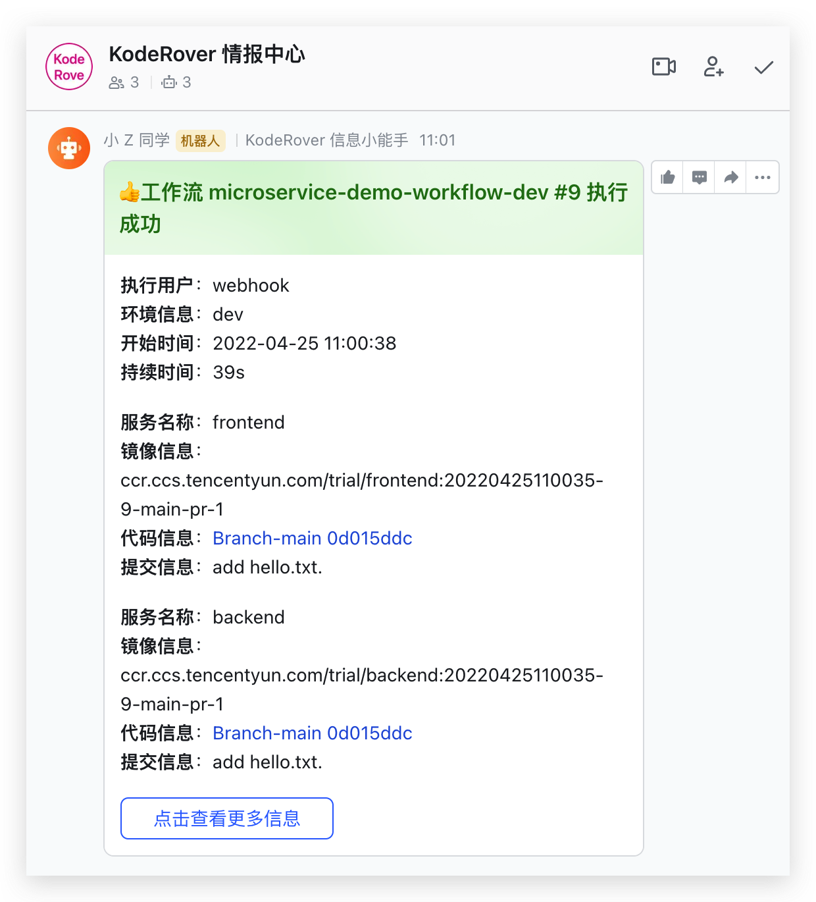
