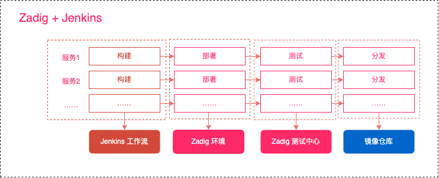
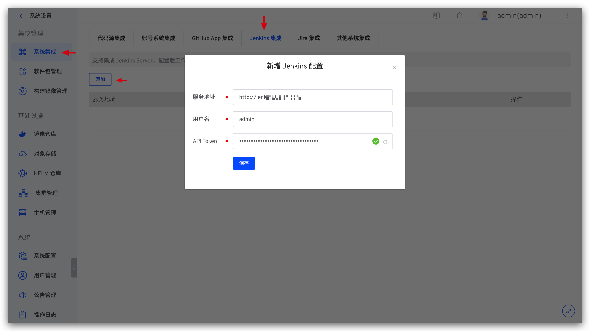
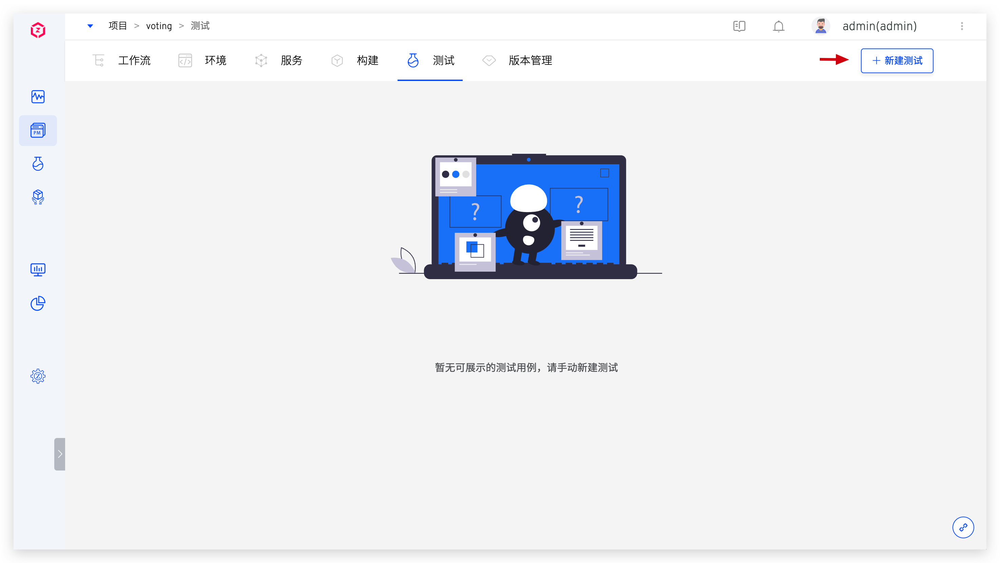
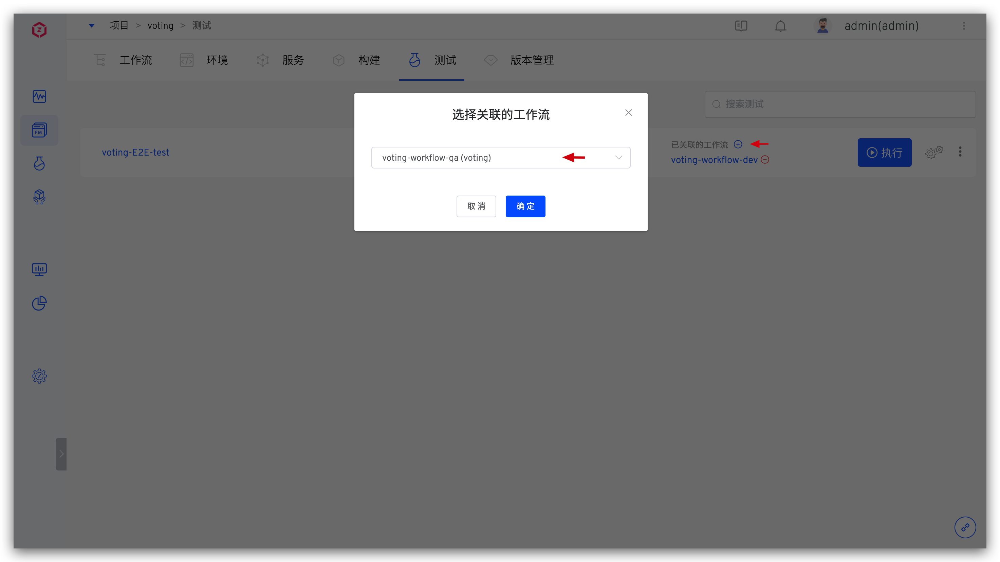
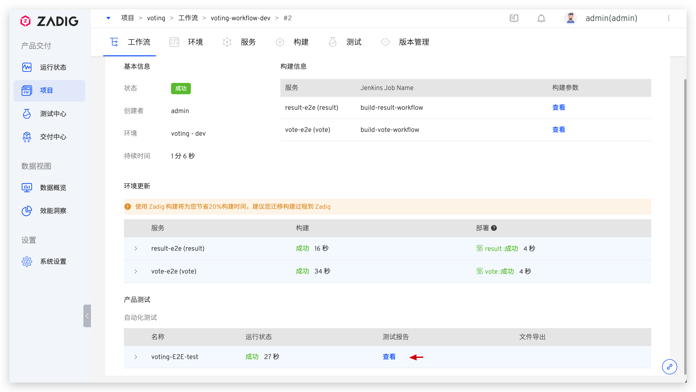

summary: 如何用 Jenkins + Zadig 分分钟搞定测试环境
id: Jenkins
categories: Jenkins
environments: Web
status: Published
feedback link: https://github.com/koderover/zadig-bootcamp/issues

# 如何用 Jenkins + Zadig 分分钟搞定测试环境

## 概述

Duration: 0:01:00

本文主要介绍如何在 Zadig 上快速接入 Jenkins 工作流，实现持续交付。Jenkins 本身并非云原生设计，对于大规模微服务上云场景，Jenkins 的能力不足以支撑整个研发过程。使用 Jenkins + Zadig 进行产品交付，可以为开发提供高并发的工作流和面向服务的集成环境，方便开发日常调试，不再为缺少测试环境，抢占测试环境而困扰。

下面使用 Voting-app 作为演示项目，该项目包括 Result、Vote、Worker、DB 和 Redis 这 5 个服务，实现了一个简单的投票系统。

## 准备工作

Duration: 0:02:00

1. 服务的 Jenkins Pipeline
2. 服务的 Kubernetes Yaml 文件：[https://github.com/koderover/zadig/tree/main/examples/voting-app/freestyle-k8s-specifications](https://github.com/koderover/zadig/tree/main/examples/voting-app/freestyle-k8s-specifications)

## 集成 Jenkins

Duration: 0:02:00

- 登录 Jenkins，在用户配置中，生成一个 API Token，如下图所示。

- 访问 Zadig，点击 `系统设置` ->  `集成环境` -> `Jenkins 集成` ，添加 Jenkins 服务相关信息，如下图所示。

## 项目配置

Duration: 0:02:00

- 创建项目，voting-app 是用 Kubernetes Yaml 部署的项目，具体内容如下图所示。

- 成功创建项目，进入项目配置向导，系统预设了 2 套集成环境和 3 条工作流。

## 创建服务

Duration: 0:03:00

- 创建服务，选择从 Github 仓库导入服务的 Kubernetes Yaml。点击 `仓库托管`，在弹框中选择代码仓库和服务 Yaml 所在的文件目录，点击加载。

  系统会自动检测 Yaml 格式是否合法，导入成功后，右侧会自动解析出 Yaml 文件包含的系统变量、自定义变量和服务组件，如下图所示。

- 服务添加 Jenkins 构建，voting-app 项目中 vote 和 result 之前使用 Jenkins Pipeline 进行持续交付的，现在只需在将对应服务的 Jenkins Pipeline 关联到 Zadig 上，就可以通过 Zadig 工作流触发 Jenkins Pipeline。
> 注意：Jenkins Build Parameters 中必须存在“IMAGE”变量，作为构建镜像的名称，Jenkins 成功构建镜像后，Zadig 工作流部署阶段会使用该镜像更新服务

1. 点击`添加构建`

2. 选择 Jenkins 构建

3. 选择对应的 Jenkins job，修改变量，并保存构建

至此，我们已经成功添加了 Result 服务的 Jenkins Pipeline，vote 的 Jenkins Pipeline 配置类似，此处不再赘述。
添加成功后，点击下一步，完成服务配置。

## 加入运行环境

Duration: 0:01:00

- 进入「加入运行环境」，系统根据以上配置，自动创建 2 套环境和 3 条工作流，具体如下图所示：

## 工作流交付

Duration: 0:01:00

- 点击运行 dev 工作流，来完成 dev 环境的持续交付，如下图所示。

这里，我们可以选择多个服务同时更新到环境中。

- 执行过程中，可以看到，选择的两个服务可以并发执行。

- 在 Zadig 工作流任务中查看 Jenkins 构建的日志。

- 执行完成后，可在对应集成环境中查看服务的运行状态、查看实时日志，对服务进行调整服务数量、更换镜像、进入容器调试等操作。

## 添加测试，挂接工作流

Duration: 0:03:00

- 添加自动化测试用例

- 填写测试用例必要的执行环境，测试用例所在的代码仓库等信息。

- 保存后，可将测试用例关联到 dev 工作流。

- 完成关联后，就可以使用 Dev 工作流更新环境，并且对环境进行自动化测试，快速得到测试结果反馈。

通过以上步骤，我们已经完成了Jenkins + Zadig 的项目配置，可以看到，Zadig 补足了Jenkins 不具备的环境管理能力和测试管理能力，通过 Zadig 让研发过程变得更丝滑。

